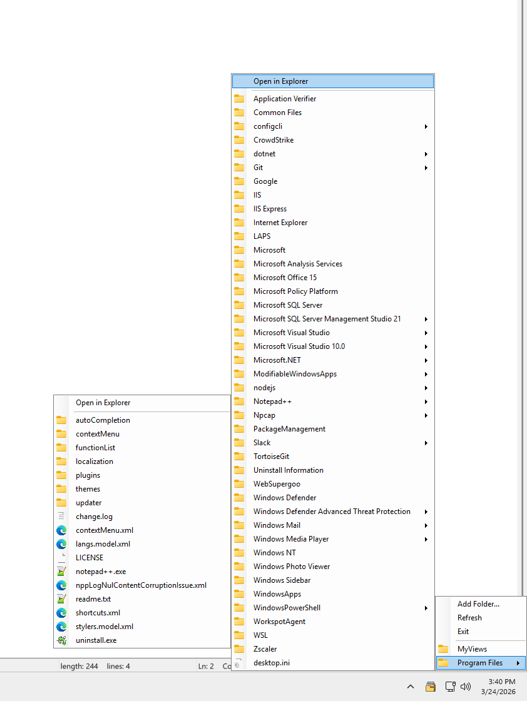

# FolderTray

## 🎉 Remember the Good Old Days?

Remember when Windows had that awesome **toolbar feature** where you could pin folders to your taskbar and browse them with a simple click? Yeah, Microsoft "upgraded" us past that in Windows 11. 😢

**Well, guess what? WE'RE BRINGING IT BACK!** 🚀

FolderTray is here to rescue you from the tyranny of endless File Explorer windows. It's like the classic Windows toolbar, but cooler, because it lives in your system tray and doesn't take up precious taskbar real estate!

## 🎭 The Tragedy (and Comedy) of Windows 11

**Microsoft:** "We removed the folder toolbar feature!"
**Users:** "But... why?"
**Microsoft:** "PROGRESS!"
**Users:** "But we loved it..."
**Microsoft:** "Here, have some rounded corners instead! 🎨"
**Users:** *sad clicking noises*

**Enter FolderTray:** "Hold my beer..." 🍺

## ✨ Features (The Good Stuff)

- 📁 **Quick Folder Access** - Add your frequently used folders to the system tray (just like the old days!)
- 🔍 **Browse Subfolders** - Navigate through folder hierarchies directly from the tray menu (no more opening 47 Explorer windows!)
- 📄 **File Icons** - Visual file type indicators with Windows shell icons (because we're fancy like that)
- 🚀 **Lightweight** - Minimal resource usage, runs silently in the background (unlike some OS updates we know...)
- 💾 **Persistent Configuration** - Your folder list is saved and restored on restart (set it and forget it!)
- 🗑️ **Remove Folders** - Changed your mind? Remove folders from the list with one click
- 🎯 **Direct File Launch** - Click any file to open it instantly (productivity level: MAXIMUM)

## 🖼️ Screenshots



*Look at that beauty! It's like 2015 all over again, but better!*

## 📥 Installation

### Option 1: Download Release (For Normal Humans)
1. Download the latest release from the [Releases](../../releases) page
2. Extract the files to a folder of your choice (maybe `C:\Program Files\FolderTray\` if you're feeling official)
3. Run `FolderTray.exe`
4. Feel the nostalgia wash over you 🌊

### Option 2: Build from Source (For the Brave Souls)
Requirements:
- .NET 8.0 SDK or later
- Windows OS (obviously, this isn't for your toaster)
- A sense of adventure 🗺️

```bash
git clone https://github.com/singingrocket/FolderTray.git
cd FolderTray/FolderTray
dotnet build -c Release
```

## 🎮 Usage (It's Super Easy!)

1. **Launch the application** - Run `FolderTray.exe` (look for the folder icon in your system tray)
2. **Add folders** - Right-click the tray icon → "Add Folder..." → Pick your favorite folder
3. **Browse folders** - Click on any folder to expand and see its contents (MAGIC! ✨)
4. **Open files** - Click on any file to open it with the default application (double-click? Nah, we're efficient here!)
5. **Open in Explorer** - Need the full Explorer experience? Right-click any folder → "Open in Explorer"
6. **Remove folders** - Changed your mind? Expand the folder → "Remove Folder" → POOF! Gone! 💨

## 🚀 Auto-Start on Windows Boot (Set It and Forget It!)

Want FolderTray to greet you every time you boot up? Here's how:

1. Press `Win + R` (or just use the Start menu like a normal person)
2. Type `shell:startup` and press Enter (watch the magic folder appear!)
3. Create a shortcut to `FolderTray.exe` in the Startup folder
4. Reboot and enjoy! Your folders will be waiting for you like a loyal puppy 🐕

**Pro Tip:** Now you can pretend Windows 11 never took this feature away. Ignorance is bliss! 😌

## ⚙️ Configuration (For the Tinkerers)

Folder paths are stored in:
```
%LocalAppData%\FolderTray\roots.txt
```

You can manually edit this file to add or remove folders if you're into that sort of thing. We won't judge. (Okay, maybe a little. Just use the UI, it's easier! 😄)

## 🔨 Building (For Developers)

### Debug Build (When You're Still Figuring Things Out)
```bash
dotnet build -c Debug
```

### Release Build (When You're Ready to Ship It!)
```bash
dotnet publish -c Release -r win-x64 --self-contained true -p:PublishSingleFile=true -p:IncludeNativeLibrariesForSelfExtract=true
```

The published executable will be in:
```
FolderTray/bin/Release/net8.0-windows/win-x64/publish/
```

**Note:** The self-contained build includes the .NET runtime, so your friends don't need to install anything. You're welcome! 🎁

## 🛠️ Technologies

- .NET 8.0 (Because we're modern like that)
- Windows Forms (Old school cool 😎)
- Windows Shell API (For those sweet, sweet file icons)
- Nostalgia (The most important ingredient)

## 🎯 Why Does This Exist?

Because sometimes "progress" means going backwards to move forward. Or something philosophical like that. Mostly, we just missed the old toolbar feature and decided to do something about it instead of complaining on Reddit. 🤷‍♂️

## 🤝 Contributing

Found a bug? Want to add a feature? Think the README is too silly? (It's not, but okay...)

Contributions are welcome! Please feel free to submit a Pull Request. Let's make Windows 11 great again! (Wait, wrong slogan...)

## 📜 License

MIT License - feel free to use, modify, share, tattoo on your body, whatever. We're cool like that.

## 👨‍💻 Author

Created with ❤️ (and a healthy dose of frustration with Windows 11) for everyone who misses the good old days.

**Dedicated to:** All the Windows users who asked "Why did they remove that?" and Microsoft replied "🤷"

---

## 💬 FAQ (Frequently Anticipated Questions)

**Q: Does this work on Windows 10?**
A: Yes! Though Windows 10 still has the toolbar feature, so you might not need it. But hey, options are good!

**Q: Does this work on Windows 11?**
A: Absolutely! That's literally why it exists. Welcome back to productivity! 🎉

**Q: Will Microsoft ban me for using this?**
A: No. This is just a regular app. Microsoft might be sad that you're working around their "improvements," but they'll get over it.

**Q: Can I add network drives?**
A: If Windows can see it as a folder, FolderTray can handle it! Go wild! 🌐

**Q: Is this better than the original Windows toolbar?**
A: We like to think so! Plus, it works on Windows 11, so... yeah! 😏

**Q: Why is the README so sarcastic?**
A: Because we're still processing our grief over losing the original feature. Humor is how we cope. 😅

---

**Star this repo if you also miss the old Windows features!** ⭐
**Share it with your friends who complain about Windows 11!** 📢
**Let's bring back the classics, one app at a time!** 🚀

